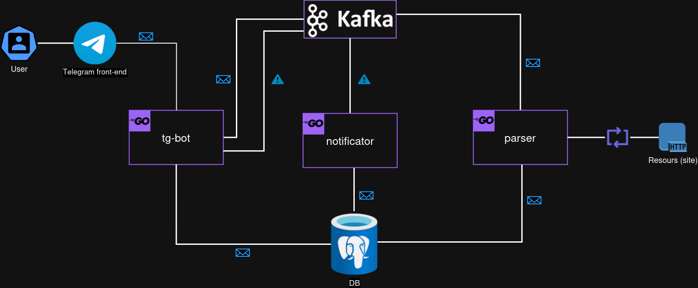

# go_docker: docker project for RouteFinder

A project written for parsing tickets from third-party resources and searching for them through a convenient telegram bot.

## ⚙️ Project architecture



- [tg-bot](https://github.com/n-kazachuk/go_tg_bot): telegram bot handler, works with the user and passes requests to other services;
- [parser](https://github.com/n-kazachuk/go_parser): searches for tickets on third-party resources and records them in the database;
- notificator (`in develop`): searches the database for free tickets at the user's request and sends them to the telegram bot.

## 🚀 Starting

```sh
docker-compose up -d --build
```